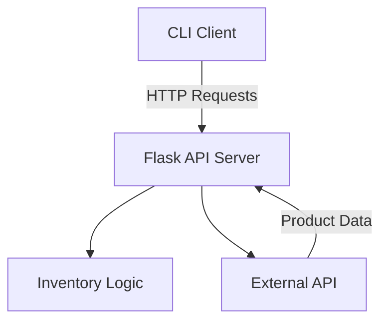

# Flask-Inventory-Management-Python-REST-API

## Project Description

This project is a backend-driven inventory management system built using Flask. It exposes a RESTful API for managing inventory items and provides a CLI client for interacting with the API.

The system supports CRUD operations and integrates with an external API to retrieve product details using barcodes. It demonstrates structured backend development, API design, and clean, maintainable Python code practices.

---

## System Architecture



**Explanation:**

The CLI client sends HTTP requests to the Flask server
The Flask API processes requests and manages inventory logic
External API (Open Food Facts) is used to fetch product details

---

## Request Flow Example

```
sequenceDiagram
    participant User
    participant CLI
    participant FlaskAPI
    participant ExternalAPI

    User->>CLI: Enter barcode
    CLI->>FlaskAPI: GET /inventory (or external fetch)
    FlaskAPI->>ExternalAPI: Request product data
    ExternalAPI-->>FlaskAPI: Return product info
    FlaskAPI-->>CLI: JSON response
    CLI-->>User: Display product details
```

---

## Features

Create, read, update, and delete inventory items
CLI-based interaction with backend API
External API integration for product lookup
Modular and maintainable codebase
Error handling and structured responses

---

## Installation and Setup Instructions

### 1. Clone the Repository

```bash
git clone <your-repo-url>
cd Flask-Inventory-Management-Python-REST-API
```

### 2. Create and Activate Virtual Environment

```bash
python3 -m venv venv
source venv/bin/activate
```

### 3. Install Dependencies

```bash
pip install -r requirements.txt
```

---

## Running the Application

Start the Flask server:

```bash
flask run --port=5555
```

---

## API Endpoint Details

Base URL:

```
http://127.0.0.1:5555/inventory
```

### Create Item

Method: POST
Endpoint: `/inventory`
Description: Adds a new item

Request:

```json
{
  "item_name": "Sample Item"
}
```

---

### Get All Items

Method: GET
Endpoint: `/inventory`
Description: Returns all inventory items

---

### Update Item

Method: PATCH
Endpoint: `/inventory/<id>`
Description: Updates item price and stock

Request:

```json
{
  "price": "100",
  "stock_level": "50"
}
```

---

### Delete Item

Method: DELETE
Endpoint: `/inventory/<id>`
Description: Deletes an item

---

## CLI Usage

Run the CLI client:

```bash
python inventory.py
```

### Example Commands

Add item:

```python
inventory.add_new_item()
```

View inventory:

```python
inventory.view_inventory_details()
```

Update item:

```python
inventory.price_stock_update()
```

Delete item:

```python
inventory.delete_item()
```

Fetch external product:

```python
inventory.get_remote_item()
```

---

## External API Integration

The system integrates with:

```
https://world.openfoodfacts.net/api/v2/product/<barcode>
```

This allows retrieval of product names and details using barcodes.

---

## Project Structure

```
.
├── inventory.py
├── test.py
├── requirements.txt
├── README.md
└── venv/
```

---

## Code Quality and Maintainability

Modular design using classes and functions
Clear separation between client (CLI) and server logic
Consistent naming conventions
Error handling implemented across API calls
Readable and well-documented methods

---

## Testing

Run basic tests:

```bash
python test.py
```

---

## Future Improvements

Add database integration using SQLAlchemy
Introduce Marshmallow for validation and serialization
Add authentication and authorization
Implement automated testing with pytest
Containerize application using Docker

---

## Author

Backend API project developed to demonstrate practical REST API design, external API integration, and maintainable Python application structure.
